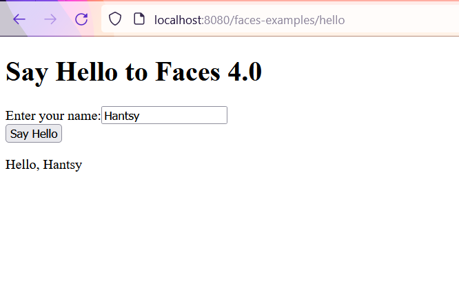
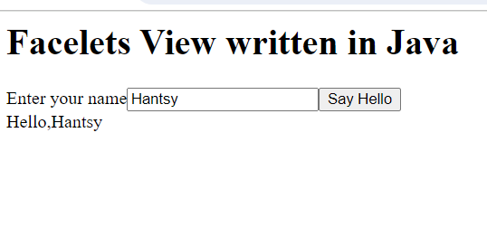
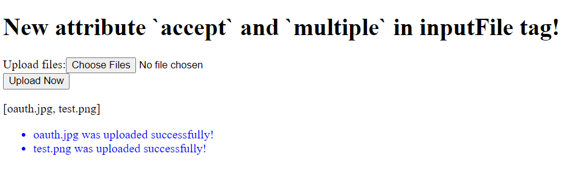

# New Features and Improvements

Next let's explore the amazing new features introduced in Faces 4.0.

## Extensionless Mapping

In the previous versions, `FacesServlet` is registered to handle mapping of *&lt;conext path>/myFacelets.xhtml*, *&lt;context path>/faces/myFacelets*, *&lt;context path>/myFacelets.faces*.

In Faces 4.0, it allows to map a URI without extension, eg. *&lt;conext path>/myFacelets*.

[Create a Jakarta EE web project](../jpa/jakartaee.md), add the following configuration in the *src/webapp/web.xml* file.

```xml
<context-param>
    <param-name>jakarta.faces.AUTOMATIC_EXTENSIONLESS_MAPPING</param-name>
    <param-value>true</param-value>
</context-param>
```

Add a simple CDI bean to activate Faces.

```java
@FacesConfig()
@ApplicationScoped
public class FacesCdiActivator {
}
```

> Note, the version attribute in annotation `@FacesConfig` is deprecated since Faces 4.0.

Create a Facelets view *src/webapp/hello.xhtml*.

```xml
<!DOCTYPE html>
<html lang="en"
      xmlns="http://www.w3.org/1999/xhtml"
      xmlns:f="jakarta.faces.core"
      xmlns:jsf="jakarta.faces"
      xmlns:h="jakarta.faces.html">
<f:view>
    <h:head>
        <title>Hello, Faces 4.0!</title>
    </h:head>
    <h:body>
        <h1>Say Hello to Faces 4.0</h1>
        <h:form prependId="false">
            <label jsf:for="name" jsf:required="true">Enter your name:</label>
            <input type="text"
                   jsf:id="name"
                   jsf:value="#{hello.name}"
                   jsf:required="true"
                   jsf:requiredMessage="Name is required."
                   placeholder="Type your name here..."
            />
            <h:message for="name"/>
            <br/>
            <input type="submit" jsf:id="submit" value="Say Hello"  jsf:action="#{hello.createMessage()}">
                <f:ajax execute="@form" render="@form"/>
            </input>
            <br/>
            <p id="message">#{hello.message}</p>
        </h:form>
    </h:body>
</f:view>
</html>
```

And create a backing bean to process the submission.

```java
@Named
@RequestScoped
public class Hello {
    private String name;
    private String message;

    public Hello() {
    }

    public void createMessage() {
        message = "Hello, " + name;
    }

    public String getName() {
        return name;
    }

    public void setName(String name) {
        this.name = name;
    }

    public String getMessage() {
        return message;
    }
}
```

Now execute the following command to run the applicaion on GlassFish.

```bash
> mvn clean package cargo:run
...
[INFO] Building war: D:\hantsylabs\jakartaee10-sandbox\faces\target\faces-examples.war
[INFO]
[INFO] --- cargo-maven3-plugin:1.10.10:run (default-cli) @ faces-examples ---
[INFO] [en3.ContainerRunMojo] Resolved container artifact org.codehaus.cargo:cargo-core-container-glassfish:jar:1.10.10 for container glassfish7x
[INFO] [talledLocalContainer] Parsed GlassFish version = [7.0.10]
[INFO] [talledLocalContainer] GlassFish 7.0.10 starting...
[INFO] [talledLocalContainer] Attempting to start cargo-domain.... Please look at the server log for more details.....
[INFO] [talledLocalContainer] GlassFish 7.0.10 started on port [8080]
[INFO] Press Ctrl-C to stop the container...
```

Open a web browser and navigate to [http://localhost:8080/faces-examples/hello](http://localhost:8080/faces-examples/hello).

> NOTE: Here we do not append any extension on the URL.



Input anything in the text input field and click the **Say Hello** button. You will see a greeting message displayed as the above image.

## Composing Facelets View in Java Codes

In the previous version, Facelets view is a standard XHTML file. Since Faces 4.0, it is possible to compose a Faceslets view in pure Java codes.

The following is an example of writing Facelets view in Java.

```java
@View("/hello-facelet.xhtml")
@ApplicationScoped
public class HelloFacelet extends Facelet {
    private static final Logger LOGGER = Logger.getLogger(HelloFacelet.class.getName());

    @Override
    public void apply(FacesContext facesContext, UIComponent root) throws IOException {
        if (!facesContext.getAttributes().containsKey(IS_BUILDING_INITIAL_STATE)) {
            return;
        }

        ComponentBuilder components = new ComponentBuilder(facesContext);
        List<UIComponent> rootChildren = root.getChildren();

        UIOutput output = new UIOutput();
        output.setValue("<html xmlns=\"http://www.w3.org/1999/xhtml\">");
        rootChildren.add(output);

        HtmlBody body = components.create(HtmlBody.COMPONENT_TYPE);
        rootChildren.add(body);

        var title = new UIOutput();
        title.setValue("<h1>Facelets View written in Java</h1>");
        body.getChildren().add(title);

        HtmlForm form = components.create(HtmlForm.COMPONENT_TYPE);
        form.setId("form");
        form.setPrependId(false);
        body.getChildren().add(form);

        HtmlOutputText message = components.create(HtmlOutputText.COMPONENT_TYPE);
        message.setId("message");
        //form.getChildren().add(message); // add to the bottom of form

        HtmlOutputLabel label = components.create(HtmlOutputLabel.COMPONENT_TYPE);
        label.setValue("Enter your name");
        form.getChildren().add(label);

        HtmlInputText name = components.create(HtmlInputText.COMPONENT_TYPE);
        name.setId("name");
        form.getChildren().add(name);

        HtmlCommandButton actionButton = components.create(HtmlCommandButton.COMPONENT_TYPE);
        actionButton.setId("button");
        actionButton.addActionListener(e -> {
                    LOGGER.log(Level.INFO, "local value: {0}", name.getLocalValue());
                    LOGGER.log(Level.INFO, "name value: {0}", name.getValue());
                    LOGGER.log(Level.INFO, "submitted value: {0}", name.getSubmittedValue());
                    var hello = "Hello," + name.getValue();
                    message.setValue(hello);
                }
        );
        actionButton.setValue("Say Hello");
        form.getChildren().add(actionButton);

        var br = new UIOutput();
        br.setValue("<br/>");
        form.getChildren().add(br);
        form.getChildren().add(message);

        output = new UIOutput();
        output.setValue("</html>");
        rootChildren.add(output);
    }

    private static class ComponentBuilder {
        FacesContext facesContext;

        ComponentBuilder(FacesContext facesContext) {
            this.facesContext = facesContext;
        }

        @SuppressWarnings("unchecked")
        <T> T create(String componentType) {
            return (T) facesContext.getApplication().createComponent(facesContext, componentType, null);
        }
    }
}
```

As you see, `HelloFacelet` view class is consist of the following facilities.

* Annotate with a `@View` annotation to specify the view id
* Extends `Facelet` and implements optional methods, one for setup Faces metadata, one for assembling the view content.
* Add a `@ApplicationScoped` to declare it as CDI bean, thus means you can inject any CDI beans as you want in this class.

In the above `HelloFacelet`, in the submit button event listener, it reads the value from input component `name`, and set the greeting message to the value of `message` component directly.

Now build and run the application.

```bash
mvn clean package cargo:run
...
[INFO] --- cargo:1.10.10:run (default-cli) @ faces-examples ---
...
[INFO] [talledLocalContainer] GlassFish 7.0.10 started on port [8080]
[INFO] Press Ctrl-C to stop the container...
```

Now open a browser and navigate to [http://localhost:8080/faces-examples/hello-facelet.xhtml](http://localhost:8080/faces-examples/hello-facelet.xhtml).



Input your name in the input box, and you will see the screen similar to the above image.

Alternatively, like regular XHTML Facelet view, we can use *expression language* to bind the input value and method in this Facelet view to a backend bean.

```java
package com.example;

import jakarta.el.ELContext;
import jakarta.el.ExpressionFactory;
import jakarta.enterprise.context.ApplicationScoped;
import jakarta.faces.annotation.View;
import jakarta.faces.component.UIComponent;
import jakarta.faces.component.UIOutput;
import jakarta.faces.component.html.*;
import jakarta.faces.context.FacesContext;
import jakarta.faces.view.facelets.Facelet;
import jakarta.inject.Inject;

import java.io.IOException;
import java.util.List;
import java.util.logging.Logger;

import static jakarta.faces.application.StateManager.IS_BUILDING_INITIAL_STATE;

@View("/hello-facelet2.xhtml")
@ApplicationScoped
public class HelloFacelet2 extends Facelet {
    private static final Logger LOGGER = Logger.getLogger(HelloFacelet2.class.getName());

    @Inject
    Hello hello;

    @Override
    public void apply(FacesContext facesContext, UIComponent root) throws IOException {
        if (!facesContext.getAttributes().containsKey(IS_BUILDING_INITIAL_STATE)) {
            return;
        }

        ELContext elContext = facesContext.getELContext();
        ExpressionFactory expressionFactory = facesContext.getApplication().getExpressionFactory();

        ComponentBuilder components = new ComponentBuilder(facesContext);
        List<UIComponent> rootChildren = root.getChildren();

        UIOutput output = new UIOutput();
        output.setValue("<html xmlns=\"http://www.w3.org/1999/xhtml\">");
        rootChildren.add(output);

        HtmlBody body = components.create(HtmlBody.COMPONENT_TYPE);
        rootChildren.add(body);

        var title = new UIOutput();
        title.setValue("<h1>Facelets View written in Java(using EL value/method binding)</h1>");
        body.getChildren().add(title);

        HtmlForm form = components.create(HtmlForm.COMPONENT_TYPE);
        form.setId("form");
        form.setPrependId(false);
        body.getChildren().add(form);

        HtmlOutputText message = components.create(HtmlOutputText.COMPONENT_TYPE);
        message.setId("message");
        message.setValueExpression("value", expressionFactory.createValueExpression(elContext, "#{hello.message}", String.class));
        //form.getChildren().add(message);

        HtmlInputText name = components.create(HtmlInputText.COMPONENT_TYPE);
        name.setId("name");
        name.setValueExpression("value", expressionFactory.createValueExpression(elContext, "#{hello.name}", String.class));
        form.getChildren().add(name);

        HtmlCommandButton actionButton = components.create(HtmlCommandButton.COMPONENT_TYPE);
        actionButton.setId("button");
        actionButton.setActionExpression(expressionFactory.createMethodExpression(elContext, "#{hello.createMessage()}", Void.class, null));
        actionButton.setValue("Say Hello");
        form.getChildren().add(actionButton);

        var br = new UIOutput();
        br.setValue("<br/>");
        form.getChildren().add(br);
        form.getChildren().add(message);

        output = new UIOutput();
        output.setValue("</html>");
        rootChildren.add(output);
    }

    private static class ComponentBuilder {
        FacesContext facesContext;

        ComponentBuilder(FacesContext facesContext) {
            this.facesContext = facesContext;
        }

        @SuppressWarnings("unchecked")
        <T> T create(String componentType) {
            return (T) facesContext.getApplication().createComponent(facesContext, componentType, null);
        }
    }
}
```

Here, we bind the input component value to a value expression `Hello.name`, and bind submit event listener to a method expression `hello.createMessage`. 

Rerun the application, navigate to [http://localhost:8080/faces-examples/hello-facelet2.xhtml](http://localhost:8080/faces-examples/hello-facelet2.xhtml) in your browser.

Input your name, you will see the screen similar to the following.


> I try to access the Java Facelet view via the URL without an extension, it does not work, see [Mojarra issue #5362]( https://github.com/eclipse-ee4j/mojarra/issues/5362).

## New Scope: ClientWindowScoped

Faces 4.0 introduce a new CDI compatiable scope, a bean annotated with `@ClientWindowScoped` will be persist since the browser window/tab is open and will be destroyed till the window/tab is closed.

Add the `jakarta.faces.CLIENT_WINDOW_MODE` to enable `ClientWindowScoped` support. The value `url` means it will append a query param `jfwid` to identify the current window.

```xml
<context-param>
    <param-name>jakarta.faces.CLIENT_WINDOW_MODE</param-name>
    <param-value>url</param-value>
</context-param>
```     
You can configure `jakarta.faces.NUMBER_OF_CLIENT_WINDOWS` to specify the maximum windows number that is allowed to create in a client.

```xml
<context-param>
    <param-name>jakarta.faces.NUMBER_OF_CLIENT_WINDOWS</param-name>
    <param-value>50</param-value> <!-- default is 10 -->
</context-param>
```

Let's create an example to experience.

```java
@Named
@ClientWindowScoped
public class Chat implements Serializable {

    private static final Logger LOGGER = Logger.getLogger(Chat.class.getName());
    private List<String> messages;

    private String newMessage;

    public void send() {
        if(this.messages == null) {
            this.messages = new ArrayList<>();
        }

        var hello = newMessage +" at "+ LocalDateTime.now();
        this.messages.add(hello);

        LOGGER.log(Level.INFO, "current message list: {0}", this.messages);
        this.newMessage = null;
    }

    public List<String> getMessages() {
        return messages;
    }

    public void setMessages(List<String> messages) {
        this.messages = messages;
    }

    public String getNewMessage() {
        return newMessage;
    }

    public void setNewMessage(String newMessage) {
        this.newMessage = newMessage;
    }
}
```
In the above codes,
* The `@Named` allows the bean is accessed by name `chat` in the Facelet view.
* It is annotated with `@ClientWindowScoped`, and implements `Serializable` interface.

Let's have a look at the view */chat.xhtml*.

```xhtml
<!DOCTYPE html>
<html lang="en"
      xmlns="http://www.w3.org/1999/xhtml"
      xmlns:f="jakarta.faces.core"
      xmlns:ui="jakarta.faces.facelets"
      xmlns:jsf="jakarta.faces"
      xmlns:h="jakarta.faces.html">
<f:view>
    <h:head>
        <title>Chat Box </title>
    </h:head>
    <h:body>
        <h1>Faces 4.0: Chat Box</h1>
        <h:form prependId="false">
            <label jsf:for="newMessage" jsf:required="true">Enter your message:</label>
            <input type="text"
                   jsf:id="newMessage"
                   jsf:value="#{chat.newMessage}"
                   jsf:required="true"
                   jsf:requiredMessage="New message is required."
                   placeholder="Type your message here..."
                   autofocus="true"
            />
            <h:message for="newMessage"/>
            <br/>
            <input type="submit" jsf:id="submit" value="Send NOW" jsf:action="#{chat.send()}">
<!--                <f:ajax execute="@form" render="@form"/>-->
            </input>
            <br/>
            <p id="message">
                <ul>
                    <ui:repeat value="#{chat.messages}" var="m">
                       <li>
                           #{m}
                       </li>
                    </ui:repeat>
                </ul>
            </p>
        </h:form>
    </h:body>
</f:view>
</html>
```

Build and run the application.

```bash
mvn clean package cargo:run
```

Open a browser and navigate to [http://localhost:8080/faces-examples/chat](http://localhost:8080/faces-examples/chat), you will the following screen.


Try to type something in the input box and hit send button, the new message will be appended to in the existing message list.

Open a new tab in the browser and try to access [http://localhost:8080/faces-examples/chat](http://localhost:8080/faces-examples/chat) again, you will there is a new window for the chat conversation, there is no existing messages, and input some message, you will find a new `jfwid` in the URL is used for this new window.

>When I enabled ajax on the submit button in the view, there is no jfwid param appended to the URL in the browser window, see [Mojarra issue 5366](https://github.com/eclipse-ee4j/mojarra/issues/5366)

>And for those Facelet views written in Java codes, all URL are appended a jfwid param, see [Mojarra issue 5365](https://github.com/eclipse-ee4j/mojarra/issues/5365)

## Input File Component Improvement

The new input file component add two new attributes, `accept` and `multiple`.
* The `accept` can limit the upload file types.
* The `multiple="true"` allows you to upload multiple files at the same time.

Let's create an example to experience.

Firstly let's have a look at the Facelet view file - *inputFiles.xhtml*.

```xhtml
<!DOCTYPE html>
<html lang="en"
      xmlns="http://www.w3.org/1999/xhtml"
      xmlns:f="jakarta.faces.core"
      xmlns:jsf="jakarta.faces"
      xmlns:h="jakarta.faces.html">
<f:view>
    <h:head>
        <title>New attribute `accept` and `multiple` in inputFile tag!</title>
    </h:head>
    <h:body>
        <h1>New attribute `accept` and `multiple` in inputFile tag!</h1>
        <h:form prependId="false" enctype="multipart/form-data">
            <label jsf:for="files">Upload files:</label>
            <h:inputFile
                    multiple="true"
                    accept="image/png,image/jpeg,image/gif"
                    id="files"
                    value="#{inputFiles.files}"
                    required="true"
                    requiredMessage="Files is required."
                    placeholder="Choose files from Disk..."
            />
            <h:message for="files"/>
            <br/>
            <input type="submit" jsf:id="submit" value="Upload Now" jsf:action="#{inputFiles.submit()}">
            </input>
            <br/>
            <p>#{inputFiles.uploadedFiles}</p>
            <h:message globalOnly="true" showSummary="true"></h:message>
        </h:form>
    </h:body>
</f:view>
</html>
```
The backend bean - *InputFiles.java*.

```java

@Named
@RequestScoped
public class InputFiles {
    private static final Logger LOGGER = Logger.getLogger(InputFiles.class.getSimpleName());

    @Inject
    FacesContext facesContext;

    private List<Part> files;

    private List<String> uploadedFiles = new ArrayList<>();

    public List<Part> getFiles() {
        return files;
    }

    public void setFiles(List<Part> files) {
        this.files = files;
    }

    public List<String> getUploadedFiles() {
        return uploadedFiles;
    }

    public void submit() {
        LOGGER.log(Level.INFO, "uploaded file size:{0}", files.size());
        for (Part part : files) {
            String submittedFilename = part.getSubmittedFileName();
            String name = Paths.get(part.getSubmittedFileName()).getFileName().toString();
            long size = part.getSize();
            String contentType = part.getContentType();
            LOGGER.log(Level.INFO, "uploaded file: submitted filename: {0}, name:{1}, size:{2}, content type: {3}", new Object[]{
                    submittedFilename, name, size, contentType
            });

            part.getHeaderNames()
                    .forEach(headerName ->
                            LOGGER.log(Level.INFO, "header name: {0}, value: {1}", new Object[]{
                                    headerName, part.getHeader(headerName)
                            })
                    );

            uploadedFiles.add(submittedFilename);
            facesContext.addMessage(null, new FacesMessage(name + " was uploaded successfully!"));
        }
    }

}
```

Build and run the application.

```bash
mvn clean package cargo:run
```

Open a browser and navigate to [http://localhost:8080/faces-examples/inputFiles](http://localhost:8080/faces-examples/inputFiles).


Click the button *Choose Files*, it will open the system file chooser, which has already filtered the files by type that set in the `accept` attribute.

Choose some files, and press the *Upload Now* button. You wil see the following messages in the screen.



Get the example project from [https://github.com/hantsy/jakartaee10-sandbox/tree/master/faces](https://github.com/hantsy/jakartaee10-sandbox/tree/master/faces) and explore it yourself.