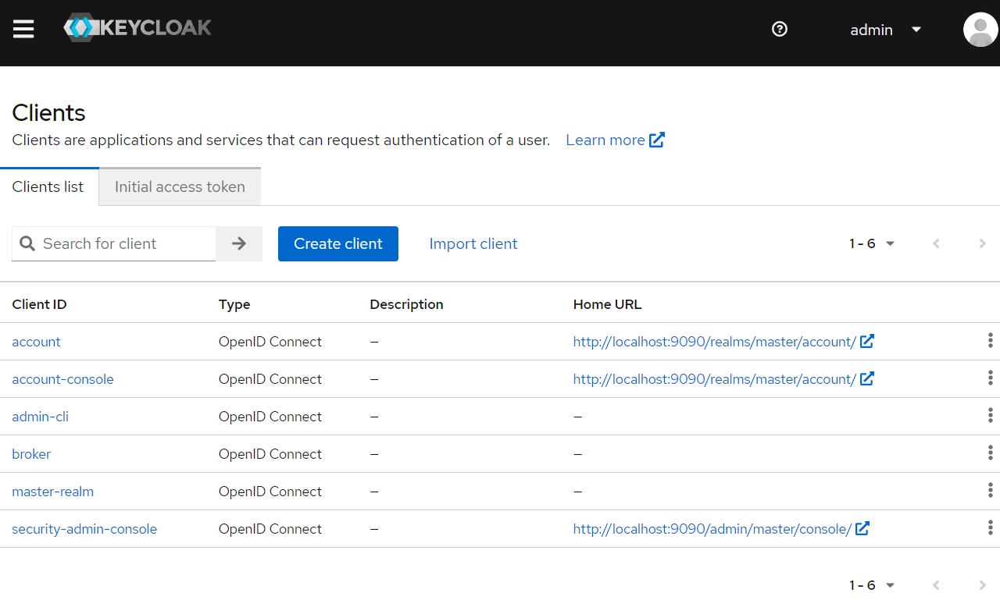

# Jakarta Security

Jakarta Security is based on the existing Jakarta Authentication and Jakarta Authorization, and defines a standard for securing your Jakarta EE applications.

In additional to the existing BASIC, FORM, and CUSTOM FORM authentication, Jakarta Security 3.0 adds OpenID Connect protocol support.

OpenID Connect 1.0 is a simple identity layer on top of the OAuth 2.0 protocol. It enables Clients to verify the identity of the End-User based on the authentication performed by an Authorization Server, as well as to obtain basic profile information about the End-User in an interoperable and REST-like manner.

Next we will explore how to configure OpenIdConnect authentication in a Jakarta web application with the popular OpenIdConnect/OAuth2 authentication providers, such as self-host [KeyCloak](https://www.keycloak.org/) server instance, and cloud based identity providers, eg. [Okta](https://www.okta.com/) and [Auth0](https://auth0.com/).

Create a simple Jakarta EE project, please refer to the steps described in the [JPA and Jakarta EE runtimes](./jpa/jakartaee.md).

Next let's create a CDI bean to declare OpenIdConnect authentication.

```java
@OpenIdAuthenticationMechanismDefinition(
        providerURI = "${oidcConfig.issuerUri}",
        clientId = "${oidcConfig.clientId}",
        clientSecret = "${oidcConfig.clientSecret}",
        redirectURI = "${baseURL}/callback",
        // redirectToOriginalResource = true,
        jwksReadTimeout = 5000
)
@ApplicationScoped
@Named("oidcConfig")
public class OidcConfig {
    private static final Logger LOGGER = Logger.getLogger(OidcConfig.class.getName());

    private String domain;
    private String clientId;
    private String clientSecret;
    private String issuerUri;

    @PostConstruct
    void init() {
        LOGGER.config("OidcConfig.init()");
        try {
            var properties = new Properties();
            properties.load(getClass().getResourceAsStream("/oidc.properties"));
            domain = properties.getProperty("domain");
            clientId = properties.getProperty("clientId");
            clientSecret = properties.getProperty("clientSecret");
            issuerUri = properties.getProperty("issuerUri");

            if (issuerUri == null && domain != null) {
                issuerUri = "https://" + this.domain + "/";
            }

            LOGGER.log(
                    Level.INFO,
                    "domain: {0}, clientId: {1}, clientSecret:{2}, issuerUri: {3}",
                    new Object[] {
                            domain,
                            clientId,
                            clientSecret,
                            issuerUri
                    });
        } catch (IOException e) {
            LOGGER.log(Level.SEVERE, "Failed to load oidc.properties from classpath", e);
        }
    }

    public String getDomain() {
        return domain;
    }

    public String getClientId() {
        return clientId;
    }

    public String getClientSecret() {
        return clientSecret;
    }

    public String getIssuerUri() {
        return issuerUri;
    }
}
```

In Jakarta Security 3.0,  a new annotation `OpenIdAuthenticationMechanismDefinition` is used to declare an OpenIdConnect authentication in a Jakarta web application.

* The `providerURI` attribute is the base URL of the OpenIdConnect provider. When a user is trying to log in, it will redirect to the login page provided by the OpenIConnect provider.
* The `clientId` and `clientSecret` is the client(our Jakarta EE application) credentials used to connect an OpenIdConnect provider.
* The `redirectURI` is the redirect URL when logged in successfully. If `redirectToOriginalResource = false`, it will always redirect to the `redirectURI`, if it is `true`, the original resource will be monitored, and redirect to it after logged in.

The `${baseURL}` is a built-in EL provided by Jakarta Security, the value is the application base URL after it is deployed into the target application servers.

The OidcConfig is also used to load the configuration attributes from a `oidc.properties` file in the classpath.

We'll create several HttpServlets to demonstrate the OpenIConnect flow.

The `PublicServlet` is a simple servlet that unsecured by Jakarta Security.

```java
@WebServlet("/public")
public class PublicServlet extends HttpServlet {

    @Override
    protected void doGet(HttpServletRequest request, HttpServletResponse response) throws IOException, IOException {
        response.setContentType("text/html");
        response.getWriter().println("<h1>Public Unsecured Servlet</h1>");
    }
}
```

The `ProtectedServlet` is secured, and we also declare roles in this application. And `foo` is allowed to access this Servlet.

```java
@WebServlet("/protected")
@DeclareRoles({"foo", "bar", "kaz"})
@ServletSecurity(
        @HttpConstraint(rolesAllowed = "foo")
)
public class ProtectedServlet extends HttpServlet {

    @Inject
    private OpenIdContext context;

    @Override
    protected void doGet(HttpServletRequest request, HttpServletResponse response) throws IOException {
        response.setContentType("text/html");
        response.getWriter().println("<h1>Protected Servlet</h1>");
        response.getWriter().println("<p>access token:" + context.getAccessToken() + "</p>");
        response.getWriter().println("<p>token type:" + context.getTokenType() + "</p>");
        response.getWriter().println("<p>subject:" + context.getSubject() + "</p>");
        response.getWriter().println("<p>expires in:" + context.getExpiresIn() + "</p>");
        response.getWriter().println("<p>refresh token:" + context.getRefreshToken() + "</p>");
        response.getWriter().println("<p>claims json:" + context.getClaimsJson() + "</p>");
    }
}
```

The `CallbackServlet` is used to redirect after logged in, here we redirect it to the `/protected` Servlet.

```java
@WebServlet("/callback")
public class CallbackServlet extends HttpServlet {
    private static final Logger LOGGER = Logger.getLogger(CallbackServlet.class.getName());

    @Override
    protected void doGet(HttpServletRequest request, HttpServletResponse response)
            throws ServletException, IOException {
        LOGGER.log(Level.FINEST, "Enter callback servlet");

        String referer = (String) request.getSession().getAttribute("Referer");
        String redirectTo = referer != null ? referer : request.getContextPath() + "/protected";
        LOGGER.log(Level.FINEST, "In /callback, redirect to: {0}", redirectTo);

        response.sendRedirect(redirectTo);
    }

}
```

The `UserNameServlet` is used to display the current user info from the `SecurityContext` bean.

```java
@WebServlet("/username")
@ServletSecurity(@HttpConstraint(rolesAllowed = {"foo", "bar"}))
public class UserNameServlet extends HttpServlet {
    private static final Logger LOGGER = Logger.getLogger(UserNameServlet.class.getName());

    @Inject
    SecurityContext securityContext;

    @Override
    protected void doGet(HttpServletRequest request, HttpServletResponse response) throws ServletException, IOException {
        String nameInRequest = request.getUserPrincipal() != null ? request.getUserPrincipal().getName() : "";
        var principal = securityContext.getCallerPrincipal();
        LOGGER.log(Level.INFO, "Principal: {0}", principal);
        var name = principal.getName();

        response.setContentType("text/html");
        response.getWriter().println("<h1>UserName Servlet</h1>");
        response.getWriter().println("<p>principal name in request userPrincipal:" + nameInRequest + "</p>");
        response.getWriter().println("<p>principal name:" + name + "</p>");
        response.getWriter().println("<p>isCallerInRole('foo'):" + securityContext.isCallerInRole("foo") + "</p>");
        response.getWriter().println("<p>isCallerInRole('bar'):" + securityContext.isCallerInRole("bar") + "</p>");
    }
}
```

To map the authenticated user to valid groups. We create a simple IdentityStore to setup groups to the authenticated users.

```java
@ApplicationScoped
public class AuthorizationIdentityStore implements IdentityStore {
    private static final Logger LOGGER = Logger.getLogger(AuthorizationIdentityStore.class.getName());

    private final Map<String, Set<String>> authorization = Map.of(
            "user", Set.of("foo", "bar"),
            "auth0|63249de53e292439f31c6be6", Set.of("foo", "bar"),
            "user@example.com",  Set.of("foo", "bar"));// user in okta.

    @Override
    public Set<ValidationType> validationTypes() {
        return EnumSet.of(PROVIDE_GROUPS);
    }

    @Override
    public Set<String> getCallerGroups(CredentialValidationResult validationResult) {
        var principal = validationResult.getCallerPrincipal().getName();
        LOGGER.log(Level.INFO, "Get principal name in validation result: {0}", principal);
        return authorization.get(principal) == null ? Collections.<String>emptySet() : authorization.get(principal);
    }

}
```

Next, we will prepare the identity providers and use them as OpenIdConnect provides in our application.

## KeyCloak

KeyCloak is the most popular open source OAuth2/OpenIdConnect solutions in the Java communities. Currently it is mainly maintained by RedHat and it is also the base of RedHat SSO commercial product.

There are [several guides](https://www.keycloak.org/guides) to start a KeyCloak instance on your local system.

Here we use Docker to run KeyCloak server, and start a KeyCloak instance via a predefined docker compose file.

```yaml
# file name: keycloak-mysql.yaml
version: '3'

volumes:
  mysql_data:
      driver: local

services:
  mysql:
      image: mysql:5.7
      volumes:
        - mysql_data:/var/lib/mysql
      environment:
        MYSQL_ROOT_PASSWORD: root
        MYSQL_DATABASE: keycloak
        MYSQL_USER: keycloak
        MYSQL_PASSWORD: password
  keycloak:
      image: quay.io/keycloak/keycloak:latest
      environment:
        KC_DB: mysql
        KC_DB_URL: jdbc:mysql://mysql:3306/keycloak
        KC_DB_USERNAME: keycloak
        KC_DB_PASSWORD: password
        KEYCLOAK_ADMIN : admin
        KEYCLOAK_ADMIN_PASSWORD: Pa55w0rd
        # Uncomment the line below if you want to specify JDBC parameters. The parameter below is just an example, and it shouldn't be used in production without knowledge. It is highly recommended that you read the MySQL JDBC driver documentation in order to use it.
        #JDBC_PARAMS: "connectTimeout=30000"
      ports:
        - 9090:8080
      depends_on:
        - mysql
      entrypoint: ["/opt/keycloak/bin/kc.sh", "start-dev"]

```

Open a terminal, execute the following command to start KeyCloak.

```bash
docker compose -f ./keycloak-mysql.yaml up
```

After it is started successfully, open your browser and navigate to <http://localhost:9090>, you will see the following KeyCloak welcome page.


Click the *Administration Console* link, try to login with credentials *admin/Pa55w0rd*.


After logged in, you will see the following screen.


Click the admin menu, select *Clients*, in the clients page, click the *Create Client* button.



In the *Create Client* page, fill the client info like the following screen.


