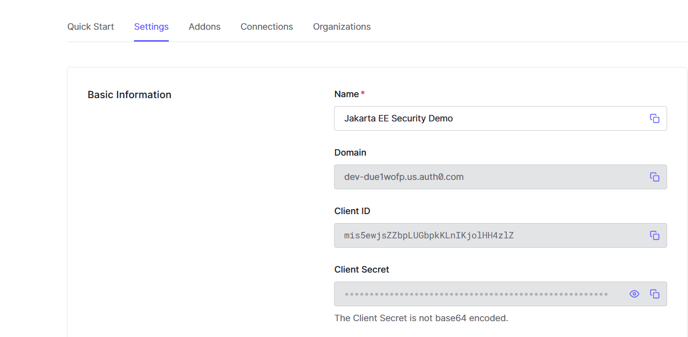
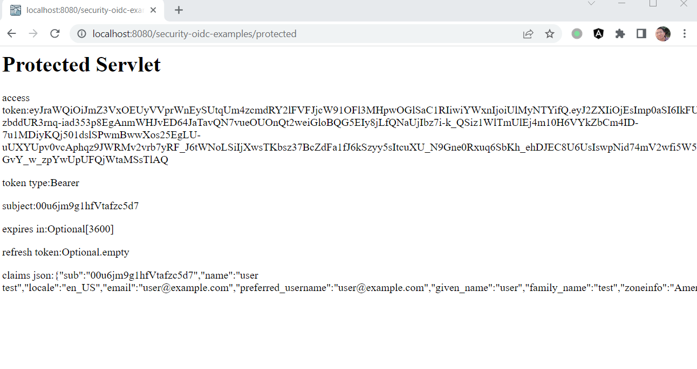

# Jakarta Security

Jakarta Security is based on the existing Jakarta Authentication and Jakarta Authorization, and defines a standard for securing your Jakarta EE applications.

In additional to the existing BASIC, FORM, and CUSTOM FORM authentication, Jakarta Security 3.0 adds OpenID Connect protocol support.

OpenID Connect 1.0 is a simple identity layer on top of the OAuth 2.0 protocol. It enables Clients to verify the identity of the End-User based on the authentication performed by an Authorization Server, as well as to obtain basic profile information about the End-User in an interoperable and REST-like manner.

Next we will explore how to configure OpenIdConnect authentication in a Jakarta web application with the popular OpenIdConnect/OAuth2 authentication providers, such as self-host [KeyCloak](https://www.keycloak.org/) server instance, and cloud based identity providers, eg. [Okta](https://www.okta.com/) and [Auth0](https://auth0.com/).

## Preparing Jakarta EE Security Example Project

Create a simple Jakarta EE project, please refer to the steps described in the [JPA and Jakarta EE runtimes](./jpa/jakartaee.md).

Next let's create a CDI bean to declare OpenIdConnect authentication.

```java
@OpenIdAuthenticationMechanismDefinition(
        providerURI = "${oidcConfig.issuerUri}",
        clientId = "${oidcConfig.clientId}",
        clientSecret = "${oidcConfig.clientSecret}",
        redirectURI = "${baseURL}/callback",
        // redirectToOriginalResource = true,
        jwksReadTimeout = 5000
)
@ApplicationScoped
@Named("oidcConfig")
public class OidcConfig {
    private static final Logger LOGGER = Logger.getLogger(OidcConfig.class.getName());

    private String domain;
    private String clientId;
    private String clientSecret;
    private String issuerUri;

    @PostConstruct
    void init() {
        LOGGER.config("OidcConfig.init()");
        try {
            var properties = new Properties();
            properties.load(getClass().getResourceAsStream("/oidc.properties"));
            domain = properties.getProperty("domain");
            clientId = properties.getProperty("clientId");
            clientSecret = properties.getProperty("clientSecret");
            issuerUri = properties.getProperty("issuerUri");

            if (issuerUri == null && domain != null) {
                issuerUri = "https://" + this.domain + "/";
            }

            LOGGER.log(
                    Level.INFO,
                    "domain: {0}, clientId: {1}, clientSecret:{2}, issuerUri: {3}",
                    new Object[] {
                            domain,
                            clientId,
                            clientSecret,
                            issuerUri
                    });
        } catch (IOException e) {
            LOGGER.log(Level.SEVERE, "Failed to load oidc.properties from classpath", e);
        }
    }

    public String getDomain() {
        return domain;
    }

    public String getClientId() {
        return clientId;
    }

    public String getClientSecret() {
        return clientSecret;
    }

    public String getIssuerUri() {
        return issuerUri;
    }
}
```

In Jakarta Security 3.0,  a new annotation `OpenIdAuthenticationMechanismDefinition` is used to declare an OpenIdConnect authentication in a Jakarta web application.

* The `providerURI` attribute is the base URL of the OpenIdConnect provider. When a user is trying to log in, it will redirect to the login page provided by the OpenIConnect provider.
* The `clientId` and `clientSecret` is the client(our Jakarta EE application) credentials used to connect an OpenIdConnect provider.
* The `redirectURI` is the redirect URL when logged in successfully. If `redirectToOriginalResource = false`, it will always redirect to the `redirectURI`, if it is `true`, the original resource will be monitored, and redirect to it after logged in.

The `${baseURL}` is a built-in EL provided by Jakarta Security, the value is the application base URL after it is deployed into the target application servers.

The OidcConfig is also used to load the configuration attributes from a `oidc.properties` file in the classpath.

We'll create several HttpServlets to demonstrate the OpenIConnect flow.

The `PublicServlet` is a simple servlet that unsecured by Jakarta Security.

```java
@WebServlet("/public")
public class PublicServlet extends HttpServlet {

    @Override
    protected void doGet(HttpServletRequest request, HttpServletResponse response) throws IOException, IOException {
        response.setContentType("text/html");
        response.getWriter().println("<h1>Public Unsecured Servlet</h1>");
    }
}
```

The `ProtectedServlet` is secured, and we also declare roles in this application. And `foo` is allowed to access this Servlet.

```java
@WebServlet("/protected")
@DeclareRoles({"foo", "bar", "kaz"})
@ServletSecurity(
        @HttpConstraint(rolesAllowed = "foo")
)
public class ProtectedServlet extends HttpServlet {

    @Inject
    private OpenIdContext context;

    @Override
    protected void doGet(HttpServletRequest request, HttpServletResponse response) throws IOException {
        response.setContentType("text/html");
        response.getWriter().println("<h1>Protected Servlet</h1>");
        response.getWriter().println("<p>access token:" + context.getAccessToken() + "</p>");
        response.getWriter().println("<p>token type:" + context.getTokenType() + "</p>");
        response.getWriter().println("<p>subject:" + context.getSubject() + "</p>");
        response.getWriter().println("<p>expires in:" + context.getExpiresIn() + "</p>");
        response.getWriter().println("<p>refresh token:" + context.getRefreshToken() + "</p>");
        response.getWriter().println("<p>claims json:" + context.getClaimsJson() + "</p>");
    }
}
```

The `CallbackServlet` is used to redirect after logged in, here we redirect it to the `/protected` Servlet.

```java
@WebServlet("/callback")
public class CallbackServlet extends HttpServlet {
    private static final Logger LOGGER = Logger.getLogger(CallbackServlet.class.getName());

    @Override
    protected void doGet(HttpServletRequest request, HttpServletResponse response)
            throws ServletException, IOException {
        LOGGER.log(Level.FINEST, "Enter callback servlet");

        String referer = (String) request.getSession().getAttribute("Referer");
        String redirectTo = referer != null ? referer : request.getContextPath() + "/protected";
        LOGGER.log(Level.FINEST, "In /callback, redirect to: {0}", redirectTo);

        response.sendRedirect(redirectTo);
    }

}
```

The `UserNameServlet` is used to display the current user info from the `SecurityContext` bean.

```java
@WebServlet("/username")
@ServletSecurity(@HttpConstraint(rolesAllowed = {"foo", "bar"}))
public class UserNameServlet extends HttpServlet {
    private static final Logger LOGGER = Logger.getLogger(UserNameServlet.class.getName());

    @Inject
    SecurityContext securityContext;

    @Override
    protected void doGet(HttpServletRequest request, HttpServletResponse response) throws ServletException, IOException {
        String nameInRequest = request.getUserPrincipal() != null ? request.getUserPrincipal().getName() : "";
        var principal = securityContext.getCallerPrincipal();
        LOGGER.log(Level.INFO, "Principal: {0}", principal);
        var name = principal.getName();

        response.setContentType("text/html");
        response.getWriter().println("<h1>UserName Servlet</h1>");
        response.getWriter().println("<p>principal name in request userPrincipal:" + nameInRequest + "</p>");
        response.getWriter().println("<p>principal name:" + name + "</p>");
        response.getWriter().println("<p>isCallerInRole('foo'):" + securityContext.isCallerInRole("foo") + "</p>");
        response.getWriter().println("<p>isCallerInRole('bar'):" + securityContext.isCallerInRole("bar") + "</p>");
    }
}
```

To map the authenticated user to valid groups. We create a simple IdentityStore to setup groups to the authenticated users.

```java
@ApplicationScoped
public class AuthorizationIdentityStore implements IdentityStore {
    private static final Logger LOGGER = Logger.getLogger(AuthorizationIdentityStore.class.getName());

    private final Map<String, Set<String>> authorization = Map.of(
            "user", Set.of("foo", "bar"),
            "auth0|63249de53e292439f31c6be6", Set.of("foo", "bar"),
            "user@example.com",  Set.of("foo", "bar"));// user in okta.

    @Override
    public Set<ValidationType> validationTypes() {
        return EnumSet.of(PROVIDE_GROUPS);
    }

    @Override
    public Set<String> getCallerGroups(CredentialValidationResult validationResult) {
        var principal = validationResult.getCallerPrincipal().getName();
        LOGGER.log(Level.INFO, "Get principal name in validation result: {0}", principal);
        return authorization.get(principal) == null ? Collections.<String>emptySet() : authorization.get(principal);
    }

}
```

Next, we will prepare the identity providers and use them as OpenIdConnect provides in our application.

## KeyCloak

KeyCloak is the most popular open source OAuth2/OpenIdConnect solutions in the Java communities. Currently it is mainly maintained by RedHat and it is also the base of RedHat SSO commercial product.

### Bootstrapping KeyCloak Instance

There are [several guides](https://www.keycloak.org/guides) to start a KeyCloak instance on your local system.

Here we use Docker to run KeyCloak server, and start a KeyCloak instance via a predefined docker compose file.

```yaml
# file name: keycloak-mysql.yaml
version: '3'

volumes:
  mysql_data:
      driver: local

services:
  mysql:
      image: mysql:5.7
      volumes:
        - mysql_data:/var/lib/mysql
      environment:
        MYSQL_ROOT_PASSWORD: root
        MYSQL_DATABASE: keycloak
        MYSQL_USER: keycloak
        MYSQL_PASSWORD: password
  keycloak:
      image: quay.io/keycloak/keycloak:latest
      environment:
        KC_DB: mysql
        KC_DB_URL: jdbc:mysql://mysql:3306/keycloak
        KC_DB_USERNAME: keycloak
        KC_DB_PASSWORD: password
        KEYCLOAK_ADMIN : admin
        KEYCLOAK_ADMIN_PASSWORD: Pa55w0rd
        # Uncomment the line below if you want to specify JDBC parameters. The parameter below is just an example, and it shouldn't be used in production without knowledge. It is highly recommended that you read the MySQL JDBC driver documentation in order to use it.
        #JDBC_PARAMS: "connectTimeout=30000"
      ports:
        - 9090:8080
      depends_on:
        - mysql
      entrypoint: ["/opt/keycloak/bin/kc.sh", "start-dev"]

```

Open a terminal, execute the following command to start KeyCloak.

```bash
docker compose -f ./keycloak-mysql.yaml up
```

### Registering Client in KeyCloak

After it is started successfully, open your browser and navigate to <http://localhost:9090>, you will see the following KeyCloak welcome page.


Click the *Administration Console* link, try to login with credentials *admin/Pa55w0rd*.


After logged in, you will see the following screen.


Click the main menu, select *Clients*, in the clients page, click the *Create Client* button.


In the *Create Client* page, fill the client info like the following screen.


Click *Next* button, in the *Capability Config* page, make sure *Client authentication* is checked.


When it is done, it redirect to the client details page. Scroll down to the *Access settings* section, set *Valid redirect URIs* and *Valid post logout redirect URIs*.


Click the *Credentials* tab, there is *Client Secrets* which will be used to connect to this authentication server from our Jakarta EE application.


### Creating Sample User

Next let's create a sample user used to login our Jakarta EE application.

Click and expand the main menu, and select *Users*, click *Create User* to create a new user.


### Running Jakarta EE Example

Next, we will add configuration to our Jakarta EE project and make sure it will connect to the KeyCloak server using the *clientId/clientSecret* we have created in the last step.

Open *src/main/resources/oidc.properties*.

```properties
# local Keycloak
issuerUri=http://localhost:9090/realms/master/
clientId=demo
clientSecret=SvbJ3kdE21kfy7KH1qihyg3XnIHdUecr
```

Then execute the following command and run our Jakarta EE application on a WildFly server.

> Due to a [SSL connection issue](https://github.com/eclipse-ee4j/glassfish/issues/24122#issuecomment-1264561421) in GlassFish, here we will use WildFly to simplify the work. If you are stick on GlassFish, please follow the comments of the issue to overcome the barrier in GlassFish.

```bash
mvn clean wildfly:run -Pwildfly
```

Open a browser, navigate to [localhost:8080/security-oidc-examples/protected](http://localhost:8080/security-oidc-examples/protected).

It will redirect to the KeyCloak login page.


Login with the new sample user you have created in the KeyCloak administration console.

After logged in successfully, it will redirect to the original request URL [localhost:8080/security-oidc-examples/protected](http://localhost:8080/security-oidc-examples/protected).


Navigate to <http://localhost:8080/security-oidc-examples/username>, it will show user info similar to the following screen.


## Auth0

Auth0 is one of the most popular cloud IDP providers.

Next, We will try to use Auth0 to replace KeyCloak as our OAuth2/OIDC authentication server role in our Jakarta EE application.

If you do not have a Auth0 account, register one using email/password paire or using a existing social account, eg Google Accounts to log in.

### Creating a Regular Web Application

After logged into the [Auth0](https://auth0.com), let's try to create a client in Auth0.

Expand *Applications/applications* in the main menu, in the *Applications* page, click *Create Application* button in right top area.

In the popup dialog, input the application name, and select *Regular Web Application*, click *Create* button.


In the applications list, click the the newly created application. It will the application details.



In the *Settings* tab, you will find the *clientId/clientSecrets* that required to connect to Auth0 from our Jakarta EE application.

Scroll down the page, in the *Application URIs* section, find the *Allowed Callback URLs* field, add our Jakarta EE application callback URL - <http://localhost:8080/security-oidc-examples/callback>.


### Creating Sample User

From the main menu, expand *User management/users*. In the users list page, click *Create User* button in the right top area to create a new user.


In the *Create User* dialog, fill the email and password, click *Create* button to create a new user.

In the users list page, click the newly created user to show the user details.

User the email info, there is a *Edit* link, click it, and click *Set Email verified*.

### Running Jakarta EE application

Open the *src/main/resources/oidc.properties*, configure the Auth0 connection info.

```properties
# Auth0
domain=dev-due1wofp.us.auth0.com
clientId=uXNJPxVo1XgtMpZ8K97lvdEUUAFaa85u
clientSecret=PAqXSI5jh26T7QjB7lYyD9KKKv_nNrtB35s3F1iUTYfQ1VVBoyptXIA-99lCD-GN
```

Similarly build and run the application on WildFly.

After it is running successfully, open a browser, and navigate to [localhost:8080/security-oidc-examples/protected](http://localhost:8080/security-oidc-examples/protected).

Ideally, after logged in, it should redirect the original request URL [localhost:8080/security-oidc-examples/protected](http://localhost:8080/security-oidc-examples/protected).

But I always encountered an exception when returning back to our Jakarta EE application.

```bash
15:13:34,809 ERROR [io.undertow.request] (default task-1) UT005023: Exception handling request to /security-oidc-examples/callback: java.lang.NullPointerException: Cannot invoke "com.n
imbusds.jwt.JWTClaimsSet.getClaims()" because "jwtClaimsSet" is null
        at org.glassfish.soteria@3.0.0//org.glassfish.soteria.mechanisms.openid.domain.AccessTokenImpl.<init>(AccessTokenImpl.java:64)
        ...
```

Unfortunately, I can not get any helpful information from the whole exception stack, see [my original post on stackoverflow](https://stackoverflow.com/questions/73752379/jakartaee-10-openidauthenticationmechanism-failed-with-auth0).

After doing some search, and print the exception stack in the Security implementation - soteria, I found there is a reading JWKS timeout exception. Of course, it is possibly an Auth0 connection issue from my side.

After customizing the attribute `jwksReadTimeout` and `jwksConnectTimeout` of the `@OpenIdAuthenticationMechanismDefinition` annotation, increase the value from the default 500 to 5000, sometime I got it works successfully.


## Okta

Okta is another famous cloud IDP provider, it is also the owner of Auth0.com.

If you do not have a Okta account, try to create one now or use social account, eg. Google Accounts to log in.

### Creating Web Application in Okta Dashboard

After logged in Okta Dashboard, in the main menu, expand *Dashboard/Getting Started*, in the *Getting Started with Okta* page, find *Create a Web Application* in the *Embed Auth into Your app* block, create the *Add Web App* button.


In the *Browse App Integration Catalog* page, click the *Create Web App* button in the right top area directly.


In the *Create a new app integration* dialog, choose the options as following:

* *Sign-in method* - **OIDC**
* *Application Type* - **Web Application**


Click the *Next* button.

In the *New Web App Integration* page, fill the following fields.

* *App integration name* - **Jakarta EE OIDC demo**
* *Sign-in redirect URIs* - **<http://localhost:8080/security-oidc-examples/callback>**
* *Sign-out redirect URIs* - **<http://localhost:8080/security-oidc-examples/public>**
* *Assignments/Controlled access* - **Skip group assignment for now**


Then click *Save* button to save the application registration.

In the application details page, you get *clientId/clientSecret* there.


### Creating Sample User Account

In the main menu, expand *Directory/People*.

In the *People* page, click *Add person* button to create a new user.

In the *Add Person* dialog, fill a sample user account information.


And click *Save* to save it.

Then in this newly created user details page, there is an *Assign Applications* button.

In the popup dialog, select the application we just created in the last step.

Click the *Reset Password* button, in the popup dialog, select create a *Temporary password*.

### Running Jakarta EE Example Application

Similarly, change content of the *oidc.properties* file to the following.

```properties
# Okta
domain=dev-64915845.okta.com
clientId=0oa6jm8qlhl4e4mDN5d7
clientSecret=Zz5EODO8MdtNlGGYSFLuoSGQQNJgZW6mUxPtZRzW
```

Build the project and deploy into WildFly.

After it is deployed successfully, open a browser and navigate to [localhost:8080/security-oidc-examples/protected](http://localhost:8080/security-oidc-examples/protected).


Use the user we just created in Okta Dashboard to log in. It will require you set up a new password if it is the first time login.

After it logged in, it will redirect to [localhost:8080/security-oidc-examples/protected](http://localhost:8080/security-oidc-examples/protected).



## Summary

The new OIDC client support is a great addon to the existing security spec, unfortunately the original plans of Digit, etc authentication are not available in this release.

For my opinion, `OpenIdAuthenticationMechanismDefinition` is not a good naming, I would like use `OidcClient` or `OpenIdConnectClient` instead of the word `OpenId`, due to OpenId itself is really a deprecated protocol by Google. But the newer `OpenIdConnect` related facilities are just addons on the top of existing OAuth2 protocol.

Additionally, I am eager there is a fluent API to assemble security configuration(authentication and authorization) through produces standard CDI beans instead of the annotations like what is provided in Spring Security configuration. Especially, when RESTful APIs become more and more popular, path pattern based security constraints is easier than the security annotations on classes or methods.
