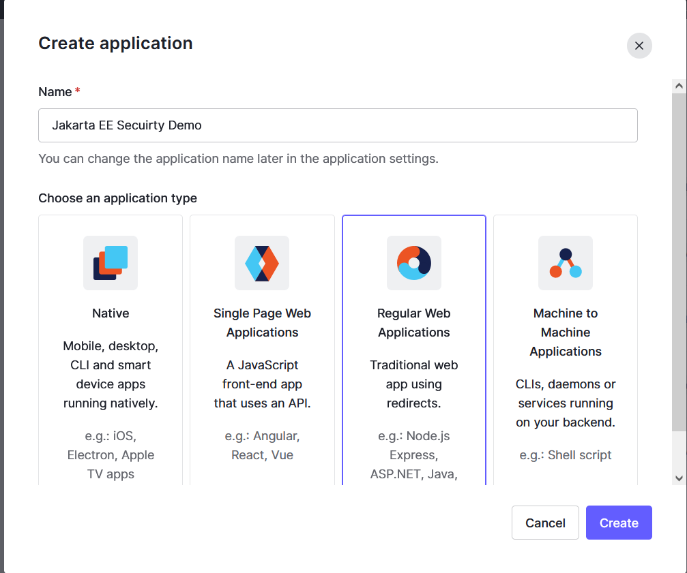
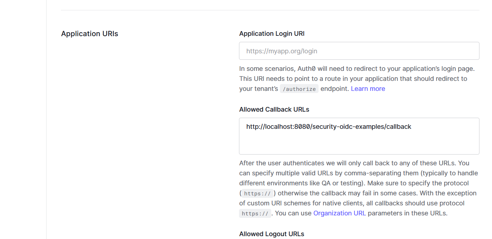

# Auth0

Auth0 is one of the most popular cloud IDP providers.

Next, We will try to use Auth0 to replace KeyCloak as our OAuth2/OIDC authentication server role in our Jakarta EE application.

If you do not have a Auth0 account, register one using email/password paire or using a existing social account, eg Google Accounts to log in.

## Creating a Regular Web Application

After logged into the [Auth0](https://auth0.com), let's try to create a client in Auth0.

Expand *Applications/applications* in the main menu, in the *Applications* page, click *Create Application* button in right top area.

In the popup dialog, input the application name, and select *Regular Web Application*, click *Create* button.



In the applications list, click the the newly created application. It will the application details.


In the *Settings* tab, you will find the *clientId/clientSecrets* that required to connect to Auth0 from our Jakarta EE application.

Scroll down the page, in the *Application URIs* section, find the *Allowed Callback URLs* field, add our Jakarta EE application callback URL - <http://localhost:8080/security-oidc-examples/callback>.



## Creating Sample User

From the main menu, expand *User management/users*. In the users list page, click *Create User* button in the right top area to create a new user.


In the *Create User* dialog, fill the email and password, click *Create* button to create a new user.

In the users list page, click the newly created user to show the user details.

User the email info, there is a *Edit* link, click it, and click *Set Email verified*.

## Running Jakarta EE application

Open the *src/main/resources/oidc.properties*, configure the Auth0 connection info.

```properties
# Auth0
domain=dev-due1wofp.us.auth0.com
clientId=uXNJPxVo1XgtMpZ8K97lvdEUUAFaa85u
clientSecret=PAqXSI5jh26T7QjB7lYyD9KKKv_nNrtB35s3F1iUTYfQ1VVBoyptXIA-99lCD-GN
```

Similarly build and run the application on WildFly.

After it is running successfully, open a browser, and navigate to [localhost:8080/security-oidc-examples/protected](http://localhost:8080/security-oidc-examples/protected).

Ideally, after logged in, it should redirect the original request URL [localhost:8080/security-oidc-examples/protected](http://localhost:8080/security-oidc-examples/protected).

But I always encountered an exception when returning back to our Jakarta EE application.

```bash
15:13:34,809 ERROR [io.undertow.request] (default task-1) UT005023: Exception handling request to /security-oidc-examples/callback: java.lang.NullPointerException: Cannot invoke "com.n
imbusds.jwt.JWTClaimsSet.getClaims()" because "jwtClaimsSet" is null
        at org.glassfish.soteria@3.0.0//org.glassfish.soteria.mechanisms.openid.domain.AccessTokenImpl.<init>(AccessTokenImpl.java:64)
        ...
```

Unfortunately, I can not get any helpful information from the whole exception stack, see [my original post on stackoverflow](https://stackoverflow.com/questions/73752379/jakartaee-10-openidauthenticationmechanism-failed-with-auth0).

After doing some search, and print the exception stack in the Security implementation - soteria, I found there is a reading JWKS timeout exception. Of course, it is possibly an Auth0 connection issue from my side.

After customizing the attribute `jwksReadTimeout` and `jwksConnectTimeout` of the `@OpenIdAuthenticationMechanismDefinition` annotation, increase the value from the default 500 to 5000, sometime I got it works successfully.


