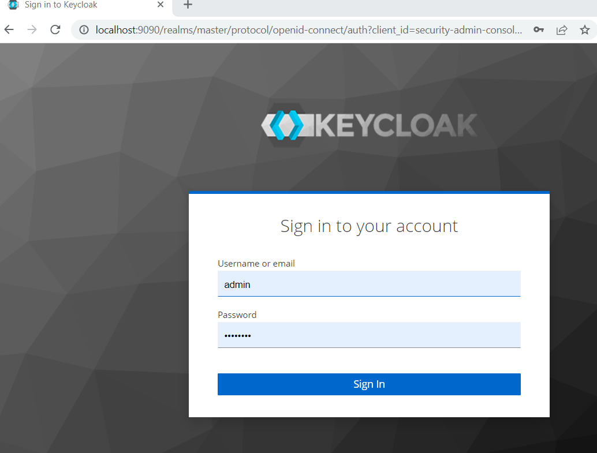
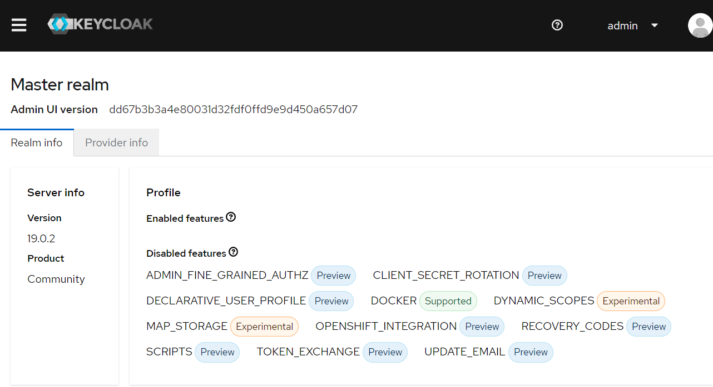
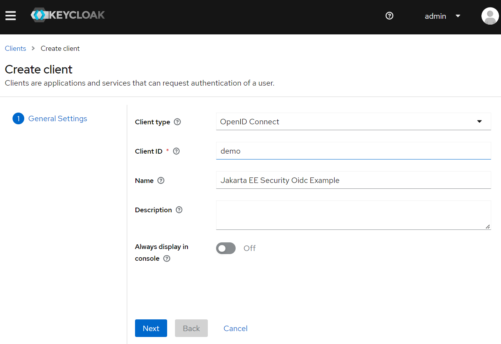
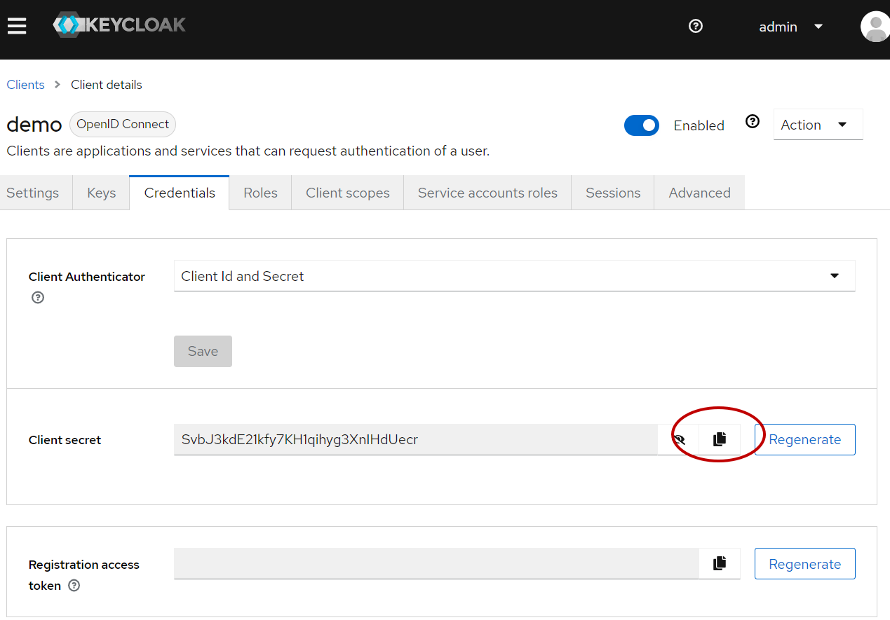
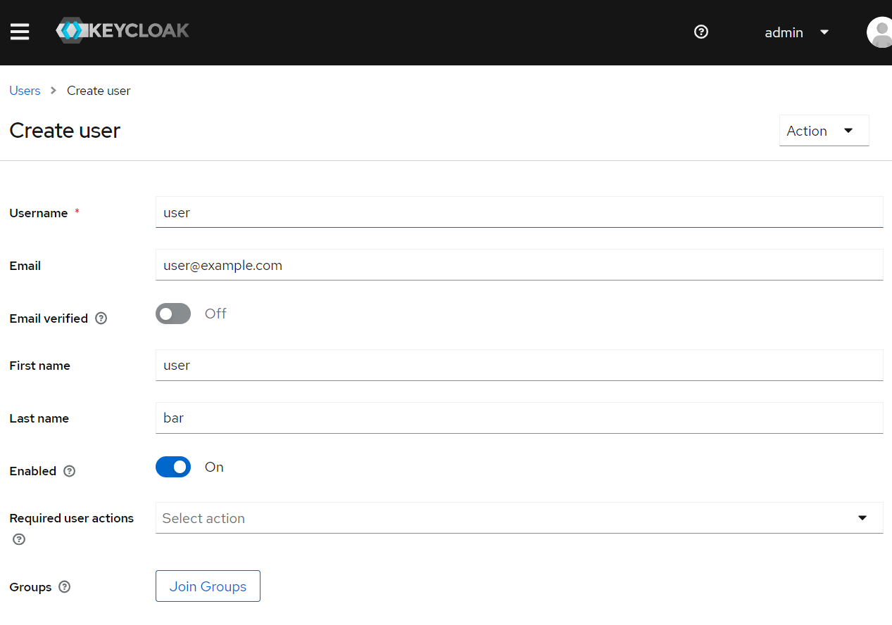
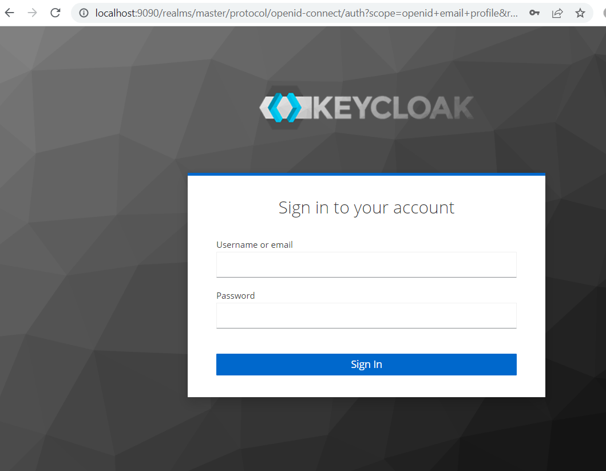
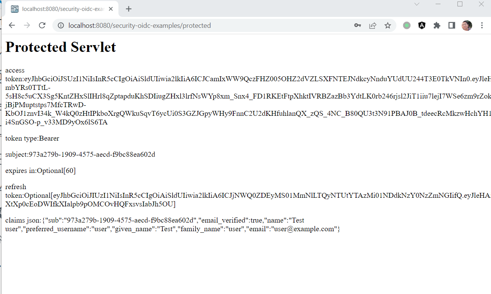
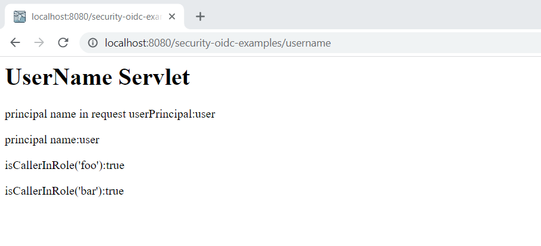

# KeyCloak

KeyCloak is the most popular open source OAuth2/OpenIdConnect solutions in the Java communities. Currently it is mainly maintained by RedHat and it is also the base of RedHat SSO commercial product.

## Bootstrapping KeyCloak Instance

There are [several guides](https://www.keycloak.org/guides) to start a KeyCloak instance on your local system.

Here we use Docker to run KeyCloak server, and start a KeyCloak instance via a predefined docker compose file.

```yaml
# file name: keycloak-mysql.yaml
version: '3'

volumes:
  mysql_data:
      driver: local

services:
  mysql:
      image: mysql:5.7
      volumes:
        - mysql_data:/var/lib/mysql
      environment:
        MYSQL_ROOT_PASSWORD: root
        MYSQL_DATABASE: keycloak
        MYSQL_USER: keycloak
        MYSQL_PASSWORD: password
  keycloak:
      image: quay.io/keycloak/keycloak:latest
      environment:
        KC_DB: mysql
        KC_DB_URL: jdbc:mysql://mysql:3306/keycloak
        KC_DB_USERNAME: keycloak
        KC_DB_PASSWORD: password
        KEYCLOAK_ADMIN : admin
        KEYCLOAK_ADMIN_PASSWORD: Pa55w0rd
        # Uncomment the line below if you want to specify JDBC parameters. The parameter below is just an example, and it shouldn't be used in production without knowledge. It is highly recommended that you read the MySQL JDBC driver documentation in order to use it.
        #JDBC_PARAMS: "connectTimeout=30000"
      ports:
        - 9090:8080
      depends_on:
        - mysql
      entrypoint: ["/opt/keycloak/bin/kc.sh", "start-dev"]

```

Open a terminal, execute the following command to start KeyCloak.

```bash
docker compose -f ./keycloak-mysql.yaml up
```

## Registering Client in KeyCloak

After it is started successfully, open your browser and navigate to <http://localhost:9090>, you will see the following KeyCloak welcome page.


Click the *Administration Console* link, try to login with credentials *admin/Pa55w0rd*.



After logged in, you will see the following screen.



Click the main menu, select *Clients*, in the clients page, click the *Create Client* button.


In the *Create Client* page, fill the client info like the following screen.



Click *Next* button, in the *Capability Config* page, make sure *Client authentication* is checked.


When it is done, it redirect to the client details page. Scroll down to the *Access settings* section, set *Valid redirect URIs* and *Valid post logout redirect URIs*.


Click the *Credentials* tab, there is *Client Secrets* which will be used to connect to this authentication server from our Jakarta EE application.



## Creating Sample User

Next let's create a sample user used to login our Jakarta EE application.

Click and expand the main menu, and select *Users*, click *Create User* to create a new user.



## Running Jakarta EE Example

Next, we will add configuration to our Jakarta EE project and make sure it will connect to the KeyCloak server using the *clientId/clientSecret* we have created in the last step.

Open *src/main/resources/oidc.properties*.

```properties
# local Keycloak
issuerUri=http://localhost:9090/realms/master/
clientId=demo
clientSecret=SvbJ3kdE21kfy7KH1qihyg3XnIHdUecr
```

Then execute the following command and run our Jakarta EE application on a WildFly server.

> Due to a [SSL connection issue](https://github.com/eclipse-ee4j/glassfish/issues/24122#issuecomment-1264561421) in GlassFish, here we will use WildFly to simplify the work. If you are stick on GlassFish, please follow the comments of the issue to overcome the barrier in GlassFish.

```bash
mvn clean wildfly:run -Pwildfly
```

Open a browser, navigate to [localhost:8080/security-oidc-examples/protected](http://localhost:8080/security-oidc-examples/protected).

It will redirect to the KeyCloak login page.



Login with the new sample user you have created in the KeyCloak administration console.

After logged in successfully, it will redirect to the original request URL [localhost:8080/security-oidc-examples/protected](http://localhost:8080/security-oidc-examples/protected).



Navigate to <http://localhost:8080/security-oidc-examples/username>, it will show user info similar to the following screen.


