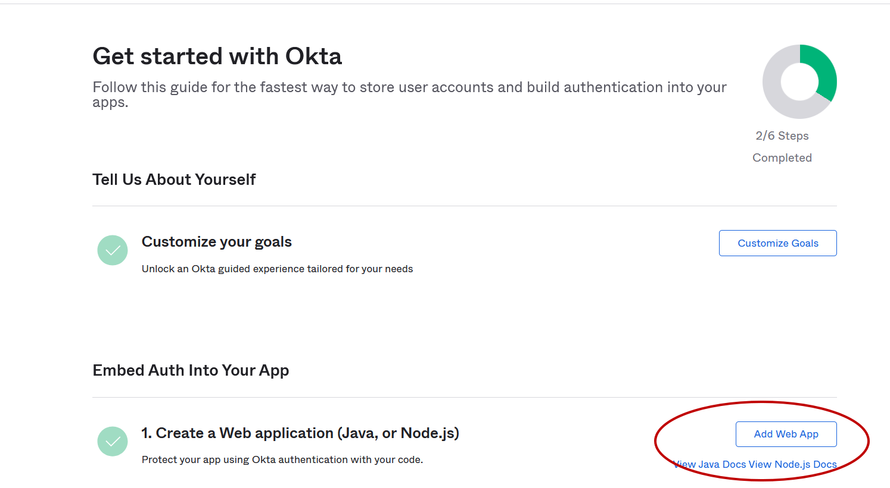
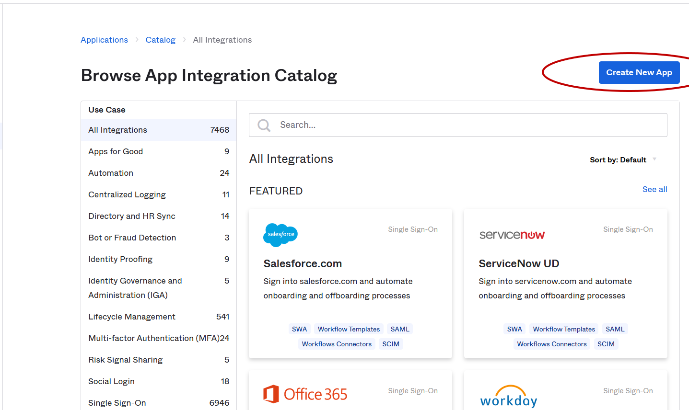
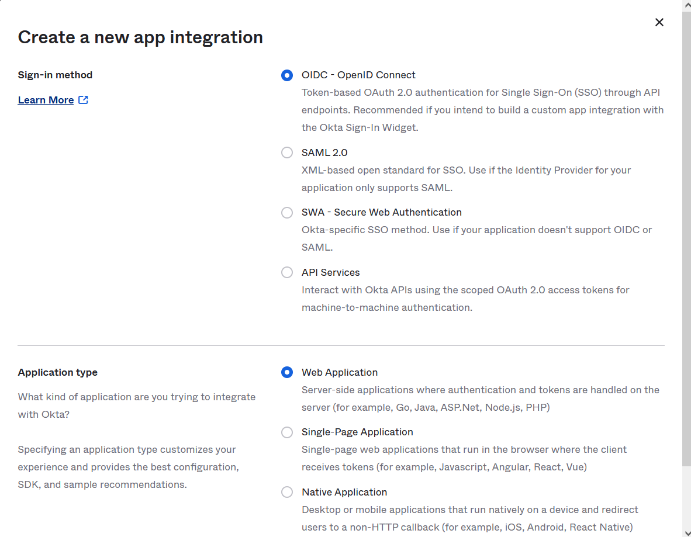
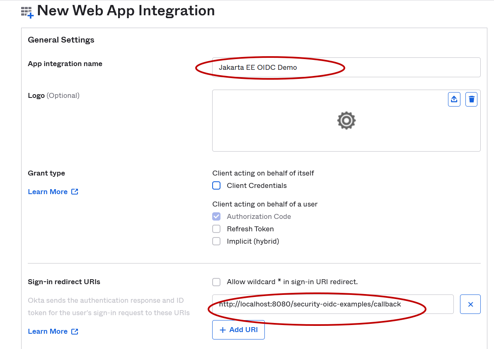
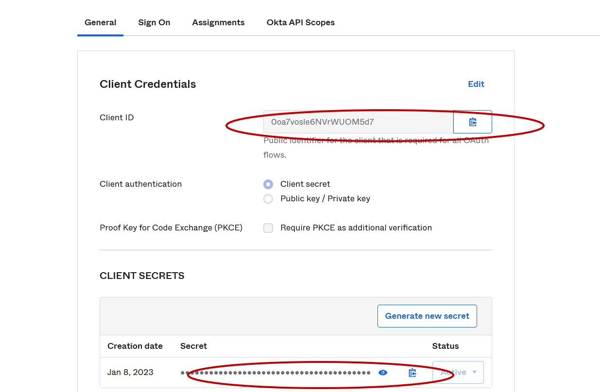
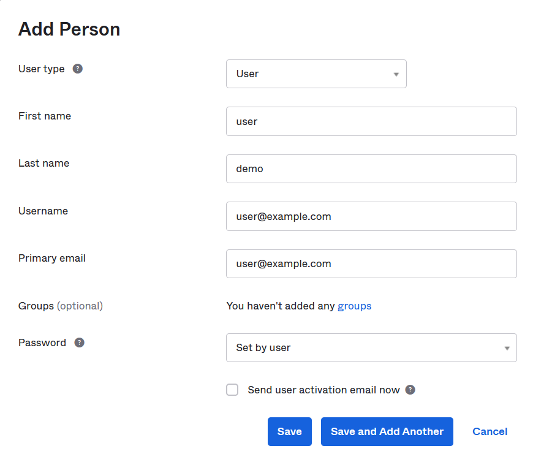

# Okta

Okta is another famous cloud IDP provider, it is also the owner of Auth0.com.

If you do not have a Okta account, try to create one now or use social account, eg. Google Accounts to log in.

## Creating Web Application in Okta Dashboard

After logged in Okta Dashboard, in the main menu, expand *Dashboard/Getting Started*, in the *Getting Started with Okta* page, find *Create a Web Application* in the *Embed Auth into Your app* block, create the *Add Web App* button.



In the *Browse App Integration Catalog* page, click the *Create Web App* button in the right top area directly.



In the *Create a new app integration* dialog, choose the options as following:

* *Sign-in method* - **OIDC**
* *Application Type* - **Web Application**



Click the *Next* button.

In the *New Web App Integration* page, fill the following fields.

* *App integration name* - **Jakarta EE OIDC demo**
* *Sign-in redirect URIs* - **<http://localhost:8080/security-oidc-examples/callback>**
* *Sign-out redirect URIs* - **<http://localhost:8080/security-oidc-examples/public>**
* *Assignments/Controlled access* - **Skip group assignment for now**



Then click *Save* button to save the application registration.

In the application details page, you get *clientId/clientSecret* there.



## Creating Sample User Account

In the main menu, expand *Directory/People*.

In the *People* page, click *Add person* button to create a new user.

In the *Add Person* dialog, fill a sample user account information.



And click *Save* to save it.

Then in this newly created user details page, there is an *Assign Applications* button.

In the popup dialog, select the application we just created in the last step.

Click the *Reset Password* button, in the popup dialog, select create a *Temporary password*.

## Running Jakarta EE Example Application

Similarly, change content of the *oidc.properties* file to the following.

```properties
# Okta
domain=dev-64915845.okta.com
clientId=0oa6jm8qlhl4e4mDN5d7
clientSecret=Zz5EODO8MdtNlGGYSFLuoSGQQNJgZW6mUxPtZRzW
```

Build the project and deploy into WildFly.

After it is deployed successfully, open a browser and navigate to [localhost:8080/security-oidc-examples/protected](http://localhost:8080/security-oidc-examples/protected).


Use the user we just created in Okta Dashboard to log in. It will require you set up a new password if it is the first time login.

After it logged in, it will redirect to [localhost:8080/security-oidc-examples/protected](http://localhost:8080/security-oidc-examples/protected).


